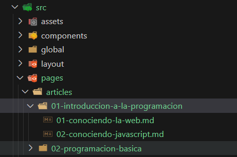
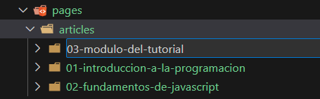
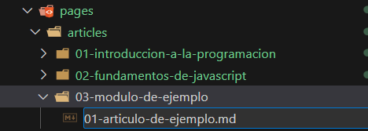

# Contribución de Artículos

La creación de artículos en ilovejs es increíblemente sencilla, ya que su diseño se centra en abstraer toda la complejidad de la implementación. Esto significa que nuestra única responsabilidad es la de redactar un artículo de calidad

## Jerarquía de Módulos y Artículos

Los módulos y los artículos se encuentran en la siguiente ruta `src/pages/articles`

 


## Nomenclatura

Esta nomenclatura se usa para nombrar `módulos` y `artículos`

```js
<orden>-<nombre> //01-example-of-name
```

1. Los dos primeros caracteres se utilizan para definir un orden (`01 , 02 , 10 , 23 , 45`)
2. Deben usarse guiones (`-`) para separar palabras (`mi-nuevo-modulo`)
3. Todo debe estar en minúsculas.

### Ejemplos

##### Nombres correctos

- 01-algoritmos
- 01-buenas-practicas
- 01-patrones-de-diseño

##### Nombres incorrectos

- 1-algoritmos
- 01 buenas practicas
- 01-Patrones-de-Diseño

## Creacion de Módulos

Cada carpeta dentro de `articles` se convertirá en un `módulo` del mismo nombre.

- El nombre del módulo debe seguir la siguiente convencion de [nomenclatura](#nomenclatura) 

 

## Creacion de Artículos

Cada archivo Markdown dentro de un `módulo` se convertirá en un `artículo`.

- El nombre del artículo debe seguir la siguiente convención de [nomenclatura](#nomenclatura) 

 

## Redacción de Artículos

Para redactar nuestros artículos sutilizaremos el siguiente [template](../src/assets/template.md)

Deberás rellenar los siguientes campos incrustados en el frontmatter

### Campos Obligatorios

- articleName : nombre del artículo e identificador único

#### Metadatos

- title : titulo de la página
- description : descripción de la página
- keywords : palabras clave referente al artículo
- layout : este campo tiene un valor único que no debes modificar


#### Cards

- summary : descripción breve de lo que trata el artículo
- iconName : nombre del archivo svg. **Si el archivo es 'icono.svg' usa solo 'icono'**
    1. primero dirígete a [svg repo](https://www.svgrepo.com/)
    2. elige el icono que más te guste y descargalo
    3. coloca el icono en la ruta `public/articles/svg`

#### Adjuntar

`! Estos campos no se deben modificar si ya fueron definidos`

- author : nombre y apellido del autor del artículo `(Jhon Doe)`
- pubDate : fecha de publicación del artículo `(2023-11-10)`

### Campos Opcionales

#### Adjuntar

- references : nombres y enlaces a las fuentes que usaste para redactar el artículo
- partners : nombres y apellidos de los contribuidores de este artículo
    - se debe respetar el orden de los nombres de los anteriores contribuidores
- banner : enlace a la imagen que el articulo usara como baner
    - **esta imagen debe ser un enlace externo**

### Finalmente

Una vez hayas rellenado los campos, puedes continuar y escribir el artículo.

Aquí algunas anotaciones extra para escribir contenido de calidad:

- la estructura del contenido es importante, si necesitas una guía visual puedes revisar otros artículos ya creados y usarlos como referencia a la hora de crear tu artículo

- Si vas a crear un artículo, asegúrate de hacerlo en el módulo adecuado. De no existir considera si es buena idea crear un nuevo módulo y si esto incentivaría a otros colaboradores a aportar contenido, ha dicho módulo

- Mantén una correcta ortografía y asegúrate de que el contenido es verídico. Está bien usar referencias externas y citar otro contenido en los que te hayas inspirado

Cuando hayas terminado puedes hacer un `pull request`. Considere leer la [guía de contribución](general.md)

Si aún no lo tienes claro considera mirar el siguiente [ejemplo](../src/assets/example.md)

## Contribucion

- Lea la [guía del proyecto](../README.md) para  mas detalles
- Lea la [guía de contribución](general.md) para  modificar y/o corregir contenido de la página
